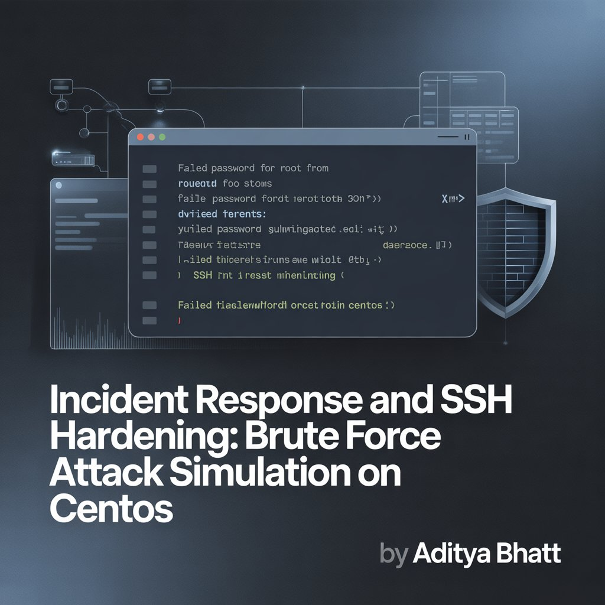
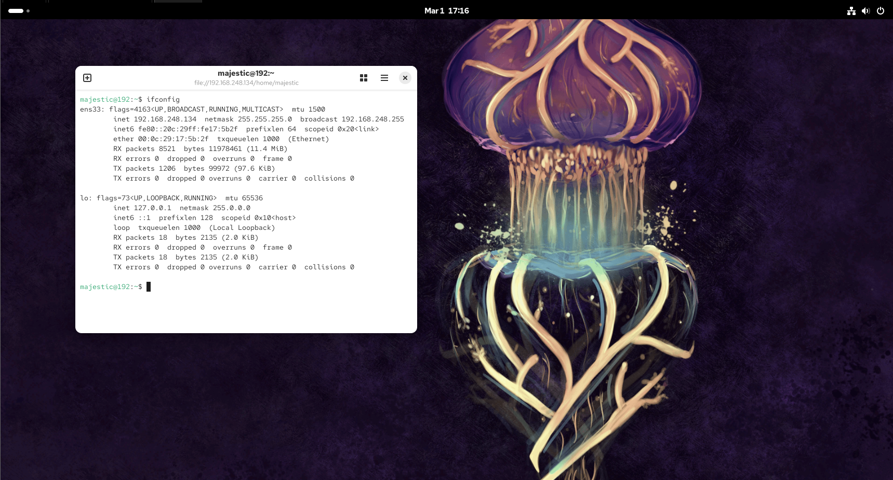
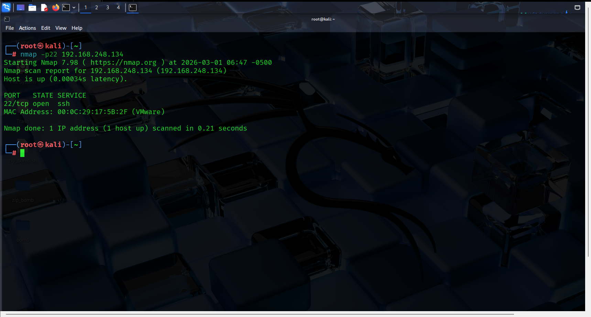
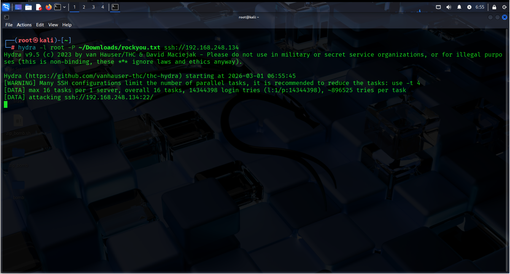
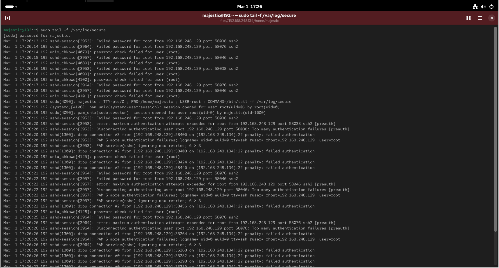
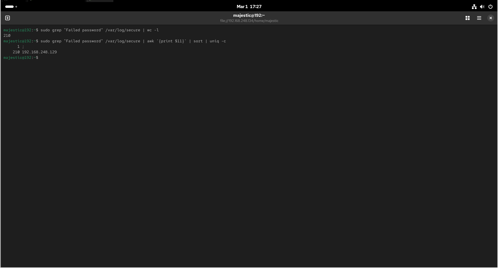
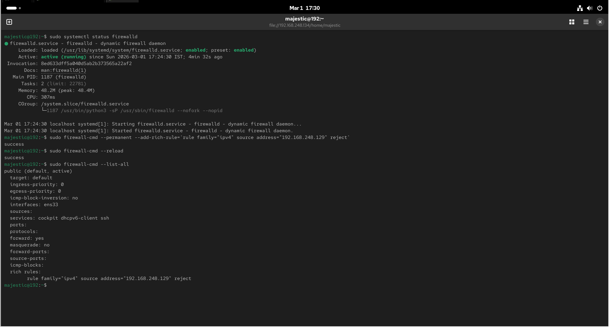
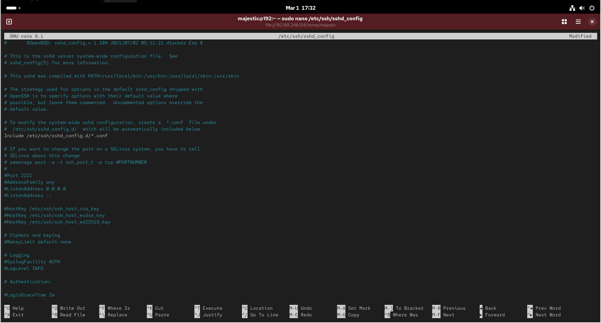
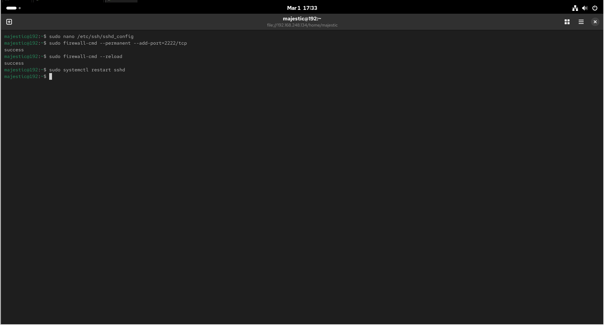

# Incident Response & Security Hardening Report  
## Brute Force Attack Simulation on CentOS Virtual Machine

**Author:** Aditya Bhatt  
**Environment:** Kali Linux (Attacker) & CentOS (Victim)  
**Victim IP Address:** 192.168.248.134  



---

## 1. System Identification – Victim Machine

The initial step involved verifying the network configuration of the CentOS virtual machine to confirm its IP address before initiating security testing.

### Command Executed

```bash
ifconfig
````

The victim system was identified with IP address:

192.168.248.134



---

## 2. Port Enumeration – SSH Service Verification

A targeted port scan was performed from Kali Linux to determine whether the SSH service was exposed.

### Command Executed

```bash
nmap -p22 192.168.248.134
```

The scan confirmed that port 22 was open and running SSH, making it a potential attack surface.



---

## 3. Brute Force Attack Simulation Using Hydra

A brute force attack simulation was conducted using Hydra against the SSH service.

### Command Executed

```bash
hydra -l root -P /usr/share/wordlists/rockyou.txt ssh://192.168.248.134
```

Multiple authentication attempts were generated against the root account.



---

## 4. Real-Time Log Monitoring

The authentication logs were monitored in real time on the CentOS system to confirm the attack.

### Command Executed

```bash
sudo tail -f /var/log/secure
```

Repeated failed login attempts were observed.



---

## 5. Log Analysis and Attacker Identification

### 5.1 Total Failed Attempts

```bash
sudo grep "Failed password" /var/log/secure | wc -l
```

### 5.2 Identify Attacker IP

```bash
sudo grep "Failed password" /var/log/secure | awk '{print $11}' | sort | uniq -c
```

The source IP responsible for the brute force attack was identified through log analysis.



---

## 6. Containment – Firewall Configuration

### 6.1 Verify Firewalld Status

```bash
sudo systemctl status firewalld
```

### 6.2 Block Attacker IP

```bash
sudo firewall-cmd --permanent --add-rich-rule='rule family="ipv4" source address="192.168.56.102" reject'
sudo firewall-cmd --reload
```

### 6.3 Verify Firewall Rules

```bash
sudo firewall-cmd --list-all
```

The malicious IP was successfully blocked.



---

## 7. SSH Hardening – Change Default Port

### Edit SSH Configuration

```bash
sudo nano /etc/ssh/sshd_config
```

Modified:

```
Port 2222
```



---

## 8. Allow New SSH Port and Restart Service

```bash
sudo firewall-cmd --permanent --add-port=2222/tcp
sudo firewall-cmd --reload
sudo systemctl restart sshd
```

The SSH service was successfully reconfigured to operate on port 2222.



---

## Conclusion

This project simulated a real-world brute force attack against a CentOS virtual machine and demonstrated structured incident response procedures, including detection, log analysis, attacker identification, containment, and system hardening.

The system was secured through firewall configuration and SSH service hardening, significantly reducing exposure to automated brute force attacks.

---
